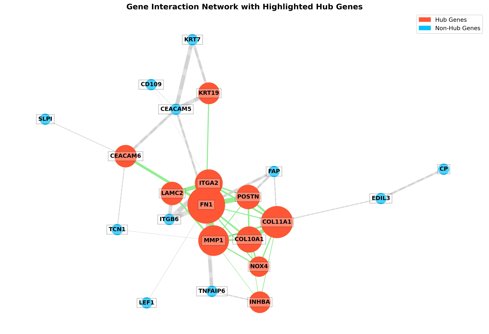

# Project Playground

Welcome to the **Project Playground**! This repository serves as a collection of various projects that I've developed over time, showcasing my skills in bioinformatics, Python programming, and more. 

## Technologies Used

This repository includes projects utilizing various technologies and tools, such as:

- Python
- R
- Bioinformatics tools (e.g., BLAST, MEGA, etc.)
- Machine Learning libraries (e.g., scikit-learn, TensorFlow, etc.)
- Data Analysis tools (e.g., Pandas, NumPy)

## Getting Started

To get a copy of this repository and run the projects locally, follow these steps:

1. Clone the repository:
   git clone [https://github.com/yourusername/ProjectPlayground](https://github.com/IkramInf/ProjectPlayground.git)

2. Navigate to the project directory:
   cd ProjectPlayground

## Contributing
Contributions are welcome! If you'd like to contribute, please fork the repository and create a pull request with your changes.

## License
This project is licensed under the MIT License - see the LICENSE file for details.

## Acknowledgments
Thank you for checking out my projects! Feel free to reach out if you have any questions or feedback.

Happy Coding!

Feel free to modify the sections as necessary to fit your projects!
